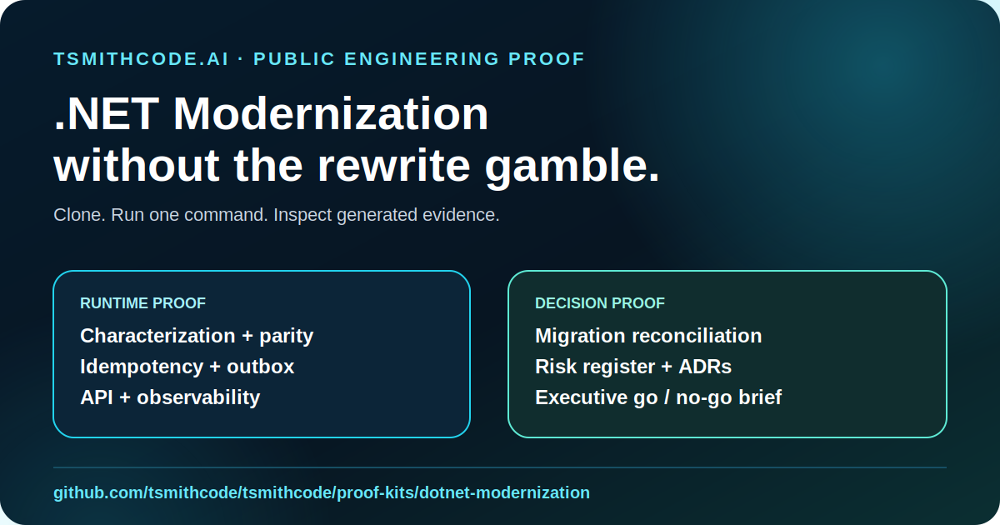

# TSmithCode .NET Modernization Proof Kit

[](https://github.com/tsmithcode/tsmithcode/actions/workflows/dotnet-modernization-proof.yml)



A public, synthetic, runnable proof of how to modernize one valuable legacy .NET capability without betting the business on a big-bang rewrite.

**Buyer question:** Can the current application be modernized safely, and what is the smallest first slice worth funding?

**Engineer promise:** Clone the repository, run one command, and inspect characterization, parity, API, idempotency, outbox, observability, migration, and decision evidence.

**Public boundary:** This kit contains no client source code, credentials, production data, private screenshots, or claimed customer ROI. The legacy system is a deliberately coupled cross-platform surrogate for common .NET Framework-era risks.

## Evaluate in one command

### macOS or Linux

```bash
cd proof-kits/dotnet-modernization
chmod +x run-proof.sh
./run-proof.sh
```

### Windows PowerShell

```powershell
cd proof-kits/dotnet-modernization
./run-proof.ps1
```

Requirements: .NET 8 SDK and Python 3. The kit uses no external NuGet or Python packages.

## What the run proves

1. **Characterization before extraction** — legacy pricing behavior is captured before modernization.
2. **Parity over opinion** — the modern pricing policy must equal the characterized legacy result.
3. **Bounded strangler slice** — order acceptance becomes independently testable without pretending the entire application was rewritten.
4. **Explicit API contract** — versioned HTTP behavior, validation, correlation, and Problem Details are reviewable in `openapi.yaml`.
5. **Duplicate safety** — a repeated idempotency key returns the original order and creates no second order or outbox event.
6. **Traceable integration boundary** — every accepted order produces one `order.accepted.v1` outbox receipt.
7. **Operational acceptance** — health, structured JSON logs, correlation IDs, and API smoke checks are included.
8. **Migration reconciliation** — synthetic legacy rows are checked for duplicates, count parity, and financial-total parity.
9. **One evidence system** — engineers and executives receive generated reports from the same run.

## Expected evidence packet

```text
reports/
  api.log
  api-smoke-receipt.json
  executive-decision-brief.md
  modernization-readiness.json
  modernization-readiness.md
  reconciliation-report.json
  risk-register.md
  test-receipt.json
  test-receipt.md
```

The CI gate requires a **100/100 readiness score** and the decision `GO: fund a bounded first modernization slice` before the proof passes.

## Architecture

| Before | After |
|---|---|
| [Coupled legacy workflow](docs/architecture-before.svg) | [Bounded .NET 8 slice](docs/architecture-after.svg) |

Read the [architecture and decision record](docs/architecture-and-decisions.md) for the strangler, idempotency, outbox, observability, rollback, and production-boundary decisions.

## Business case

The representative problem is common across manufacturing, logistics, distribution, insurance operations, healthcare administration, construction, field service, and internal finance systems: a valuable legacy workflow is difficult to change because business rules, persistence, integration, and deployment behavior are coupled.

The [business case](docs/business-case.md) includes a clearly labeled illustrative ROI model, a ten-minute engineer route, and a two-minute executive route. It does not present synthetic assumptions as customer results.

## Three-minute evaluator route

1. Read this page and the architecture visuals.
2. Run the proof.
3. Open `reports/modernization-readiness.md`.
4. Inspect `reports/test-receipt.json`, `reports/api-smoke-receipt.json`, and `reports/reconciliation-report.json`.
5. Review `openapi.yaml` and the ADRs.
6. Forward the repository or generated executive brief to the decision owner.

## Source map

```text
src/LegacyOrderEngine/          intentionally coupled legacy surrogate
src/Modernization.Core/         domain, pricing, idempotency, repository, outbox
src/Modernization.Api/          .NET 8 versioned API and operational boundary
tests/Modernization.ProofTests/ dependency-free characterization and reliability gates
fixtures/                       synthetic migration inputs and expected modern output
tools/proof_harness.py          reconciliation, API smoke, and evidence generator
docs/                           architecture, ADRs, and business case
media/                          share-ready visual asset
```

## What a paid diagnostic adds

This public proof demonstrates the decision method. A real modernization diagnostic adds source review, dependency inventory, authentication and authorization, data-store constraints, deployment topology, production telemetry, support ownership, security requirements, real business examples, measured ROI inputs, sequencing, estimate, and rollback design.

[Start the TSmithCode Software Discovery Diagnostic](https://tsmithcode.ai/software-discovery-diagnostic) · [Review pricing](https://tsmithcode.ai/software-consulting-pricing) · [Open all software proof kits](https://tsmithcode.ai/software-proof-kits)
