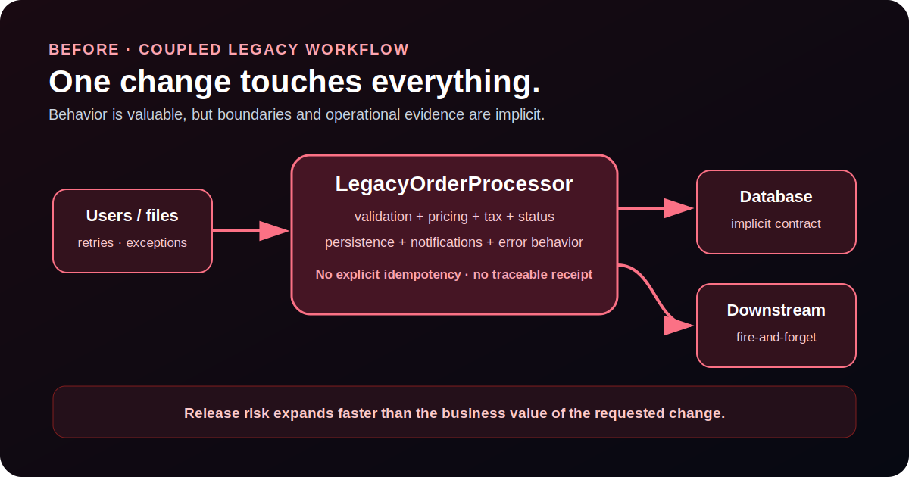
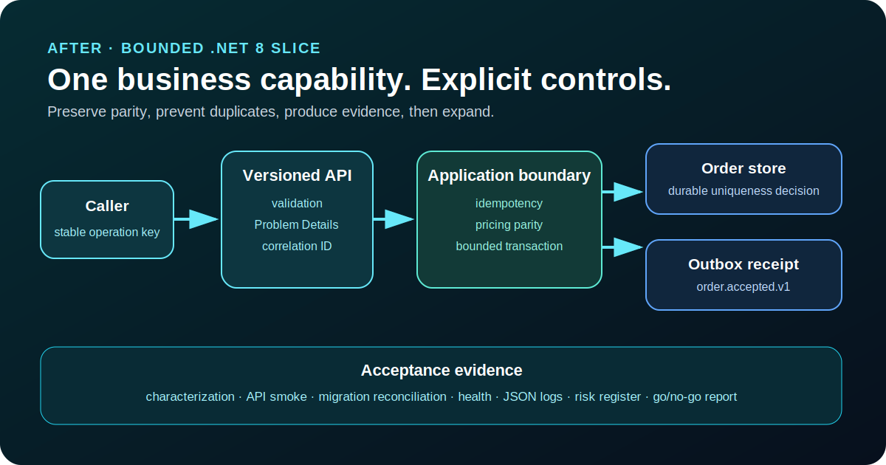

# Architecture and decision record

This proof models a bounded modernization decision, not a big-bang rewrite. The public legacy project is a synthetic, cross-platform surrogate for common .NET Framework-era coupling. It contains no customer code.

## Before: coupled legacy workflow

The legacy service mixes validation, pricing, tax, status, and implicit integration behavior in one call. The first obligation is to preserve observable business behavior before extraction.

## After: bounded .NET 8 slice

The modern slice introduces a versioned API boundary, an application service, explicit pricing policy, idempotency, an outbox receipt, correlation-aware logging, health evidence, and deterministic migration reconciliation.

## ADR-001 — Choose strangler extraction over a full rewrite

**Decision:** Extract order acceptance as the first independently testable capability while leaving the rest of the legacy system outside the public proof boundary.

**Why:** A full rewrite increases parity risk, rollout duration, and rollback complexity. A strangler slice creates a fundable decision with measurable acceptance criteria.

**Exit criteria:** Characterized pricing behavior remains equal, the API contract is stable, duplicate submissions are safe, migration totals reconcile, and the slice has an explicit rollback path.

## ADR-002 — Treat idempotency as a business control

**Decision:** Require an `Idempotency-Key` for order creation and return the original receipt when the same operation is retried.

**Why:** Retries are normal in distributed workflows. Without a durable uniqueness boundary, transport recovery can become duplicate financial or operational work.

**Production decision deferred to discovery:** database uniqueness constraint, key retention period, conflict behavior when payloads differ, replay policy, and operational ownership.

## ADR-003 — Persist an integration receipt with the business decision

**Decision:** Create one `order.accepted.v1` outbox message for each accepted order.

**Why:** A business write and downstream notification cannot be safely coordinated by hope. The public in-memory implementation demonstrates the boundary; a production implementation would persist the order and outbox message in the same durable transaction.

## ADR-004 — Make operations evidence part of acceptance

**Decision:** Include health, JSON logs, correlation IDs, API smoke receipts, test receipts, and reconciliation reports in the proof gate.

**Why:** Code that passes unit tests but cannot be traced, diagnosed, or safely replayed is not production-ready.

## Quality-attribute gate

| Quality attribute | Public proof control | Production decision required |
|---|---|---|
| Functional parity | Legacy characterization and modern parity tests | Expand against real business examples and edge cases |
| Duplicate safety | Idempotent application boundary | Durable unique constraint and payload-conflict policy |
| Integration reliability | One outbox receipt per accepted order | Broker, dispatcher, retry, dead-letter, and ownership model |
| Data correctness | Count, duplicate, and financial-total reconciliation | Field-level reconciliation and exception disposition |
| Observability | Correlation header, JSON logs, health route | Telemetry destination, alerts, dashboards, retention |
| Rollback | Bounded strangler slice | Traffic routing, feature flag, database compatibility |
| Security | No secrets or private data in public proof | Identity, authorization, secrets, threat model, audit requirements |

## Deliberate non-goals

- No customer code, screenshots, credentials, or production data.
- No fabricated client result or implied production deployment.
- No architecture layer added without a demonstrated decision boundary.
- No claim that the in-memory repository is a production persistence choice.
- No attempt to modernize every legacy surface in one proof.
